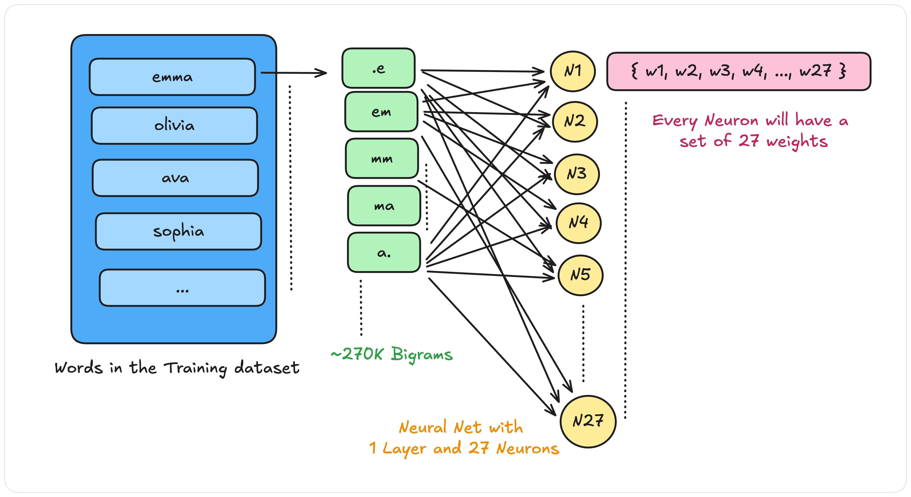

# makemore - A character level Language Model :part_alternation_mark:

Makemore is an auto-regressive character-level language model. It can take a text file as an input, where each line is assumed to be one training example and it generates more examples like it. New and Unknown...

This repo covers the work of Andrej's [makemore](https://github.com/karpathy/makemore/) repo with a more detailed documentation of each implementations. :simle:

## Implementations covered:

1. [Bigram model](#bigram-model)


## 1. Bigram model

A **Bigram** model performs next character prediction on the basis of the current character.

To implement a Bigram model, we will need a training dataset. We build our training dataset with the help of a collection of [names](/datasets/names.txt) and further plucking out the bigrams from it. Bigram here refers to the set of character pairs present in the **names** dataset.

***Goal The end goal is to generate / make more names similar to those present in the **names** dataset, but potentially never seen before in the dataset.***

Out current names dataset with approx `32K` examples looks somewhat like this.

```
emma
olivia
ava
isabella
sophia
charlotte
...
```

Now it's time to pluck out the bigrams from the above dataset. We have a special character `.` which will act as a starting and the ending character for names dataset.

Eg. `emma` will be interpreted as `.emma.`

And hence we can have following set of bigrams from this example:
`{ '.e', 'em', 'mm', 'ma', 'a.'}`

Since all the names are in lower case characters (no special characters), we can safely say that there can be `26 + 1` possible characters (including `.`) and `(26+1) * (26+1) = 729` possible bigrams.

We will maintain a map that will count the frequency of each bigrams in the training dataset. It can be visualized in this way.


We can see the above map stores the frequency of each possible bigrams. Now instead of storing frequency, let's store the probability of occurence of each bigram.


We have used [Broadcasting](https://numpy.org/doc/stable/user/basics.broadcasting.html) to achieve this in our existing bigram count map.

***Note: We have initially added 1 to all the bigram counts to perform model smoothing i.e. to avoid the presence of 0 values in the map leading to infinite log values.***

```python
# Broadcasting the column level sum
# Add 1 to all numbers i.e. perform Model smoothing to avoid negative log likelihoods
P = (N+1).float()
P = P / P.sum(1, keepdim=True)
```

The updated map with probabilities look somewhat like this.


Now, we have the probabilities of the occurnece of the next character for each character. We can start sampling more characters based on the given probability distributions.
We will use Pytorch's [Multinomial](https://pytorch.org/docs/stable/generated/torch.multinomial.html) to sample next character based on the given probability distribution.

```python

# Sampling more words
g = torch.Generator().manual_seed(2147483647)

for i in range(40):
    out = []
    ix = 0
    while True:
        p = P[ix]
        ix = torch.multinomial(p, num_samples=1, replacement=True, generator=g).item()
        out.append(itos[ix])
        if ix == 0:
            break
    print(''.join(out))

```

The sampling process described below is repeated until we reach at the end character `.`.


We can now sample more words with the above approach.

```
cexze.
momasurailezitynn.
konimittain.
llayn.
ka.
da.
staiyaubrtthrigotai.
moliellavo.
...
```

### Building a Loss function

Since we have a generation model that can generate more samples, we should also be able to determine a **Loss** function that should be able to compute the Loss of our model. In general we use to compute Loss by observing the generated resule and the actual result. But here, we have characters and hence we can't apply the standard loss caculation method.

Instead, we will use our calculated Probablility distribution table to check the likelihood of the occruence of the next character from our training dataset. Using this we will calculate the overall loss incurred on the training dataset.

```python
next_character_probability = P[current_character][next_character]
log_prod = log(next_character_probability)

# Goal is to maximize the Log likelihood i.e. the likelihood of the occurnece of the next character
# sampled from words present in the training dataset.
log_likelihood += log_prob

### Goal is to minimize the negative log likelihood.
negative_log_likelihood = -log_likelihood
```

We can use the above calculation logic for all the words present in the Training dataset.

```python
for w in words:
    chs = ['.'] + list(w) + ['.']
    for ch1, ch2 in zip(chs, chs[1:]):
        ix1 = stoi[ch1]
        ix2 = stoi[ch2]
        prob = P[ix1, ix2]
        logprob = torch.log(prob)
        log_likelihood += logprob

negative_log_likelihood = -log_likelihood
```

The above process can visualized this way.


---
### Neural Network implementation of Bigram

Let's build a Neural Network which can perform a similar thing we did above. Here instead of getting the probabilities of the next character from the pre-computed Probability table, we will train a neural net which can provide the same probability distributions.

We will further use that neural network (forward-pass) to generate more samples (words).

We will use [One Hot Encoding](https://en.wikipedia.org/wiki/One-hot) to represent our dataset. Currently we have a set of Bigrams `(ch1, ch2)` and we will build a training input X and label Y with these.

```python
for w in words:
    chs = ['.'] + list(w) + ['.']
    for ch1, ch2 in zip(chs, chs[1:]):
        ix1 = stoi[ch1]
        ix2 = stoi[ch2]
        
        X.append(ix1)
        Y.append(ix2)
```

The one-hot encoding process of preparing the Training dataset for our Neural net looks somewhat like this.


Now, we have our training dataset prepared, we will build a single Layer neural net which will have **27 Neurons** and each neuron will have **27 Weights**. The neural net will take our entire Training dataset (one-hot encoded first character of each bigram) and will create a Probability distribution.

We do this in the following manner.

```python
# Forward Pass
xenc = F.one_hot(X, num_classes=27).float()
logits = xenc @ W # log counts

# Softmax activation function
counts = logits.exp() # equivalent to N
probs = counts / counts.sum(1, keepdims=True) # probabilities for the next character
# probs.shape() = torch.Size([228146, 27])

# "probs" is an 2d-array having the probability distribution of each character
# from index 0 to 26 for all 270K bigram's first character.
# We pluck out the probability of the target character (the second character of all the 270K+ Bigrams)
# to get an array of target character probabilities.
predicted_result = probs[torch.arange(xs.nelement()), ys]
# predicted_result.shape() = torch.Size([228146])

log_likelihood = predicted_result.log()
# log_likelihood.shape() = torch.Size([228146])

negative_log_likelihood = -log_likelihood
loss = negative_log_likelihood.mean() + 0.01*(W**2).mean() # smoothing through regularization
print(loss.item())

# Backward pass
W.grad = None # Set to zero the gradient
loss.backward()

# Update weights
W.data += -50 * W.grad
```

The training process looks somewhat like this.



After repeating the above process for `100` to `200` iterations we get a Loss value of around `2.48` which was similar to what we got in our earlier Bigram model generated by pre-computed Probability map.

After training we can use the trained weights `W` to sample more words. The logic will be very similar to the way we did in our previous bigram model. The only difference will be instead of getting the probability distribution of the next characters from a pre-computed Probability map, we get it from our trained neural net.


```python
# Sampling more words through our neural net
g = torch.Generator().manual_seed(2147483647)

for i in range(20):
    out = []
    ix = 0
    while True:
        xenc = F.one_hot(torch.tensor([ix]), num_classes=27).float()
        logits = xenc @ W
        counts = logits.exp()
        #print(counts)
        p = counts / counts.sum(1, keepdims=True)


        ix = torch.multinomial(p, num_samples=1, replacement=True, generator=g).item()
        out.append(itos[ix])
        if ix == 0:
            break
    print(''.join(out))
```

## Running the project
### Virtual Environments in Python

Creating a Virtual Environment

```python
> virtualenv saurav_env

# Launching a Virtual Environment
> source saurav_env/bin/activate

# Installing dependencies in the virtual env
> pip install Django==1.9

# Deactivate Python Virtual Environment
> deactivate
```

Read more here: https://www.geeksforgeeks.org/python-virtual-environment/